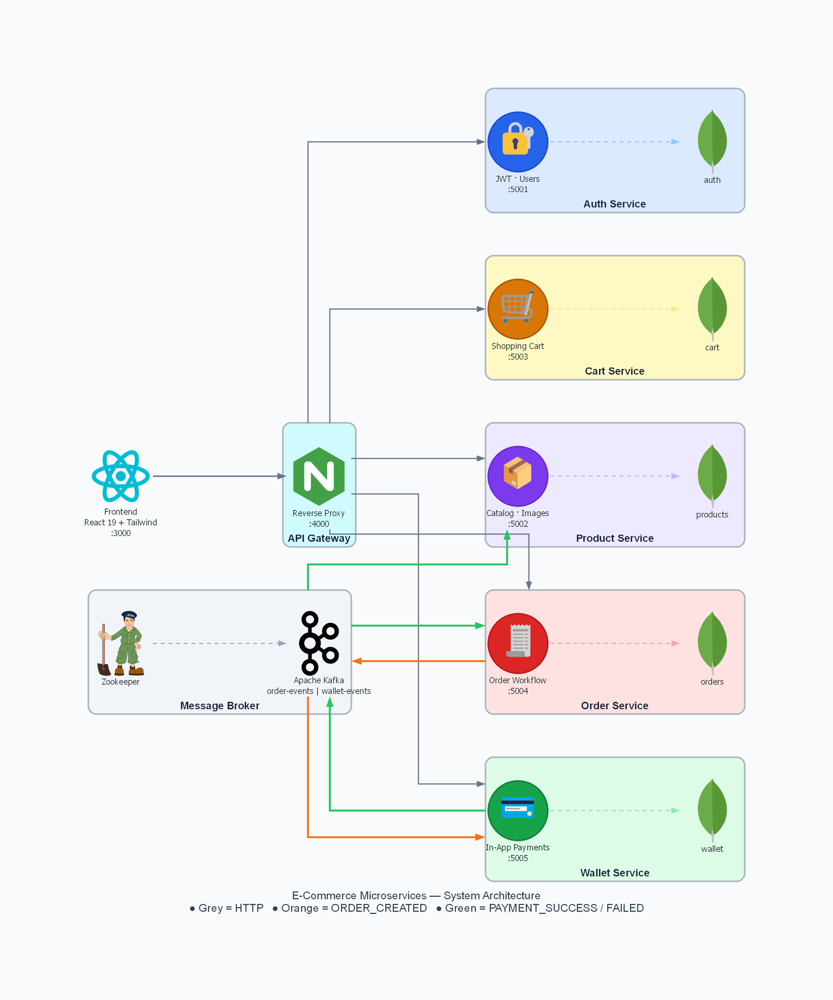
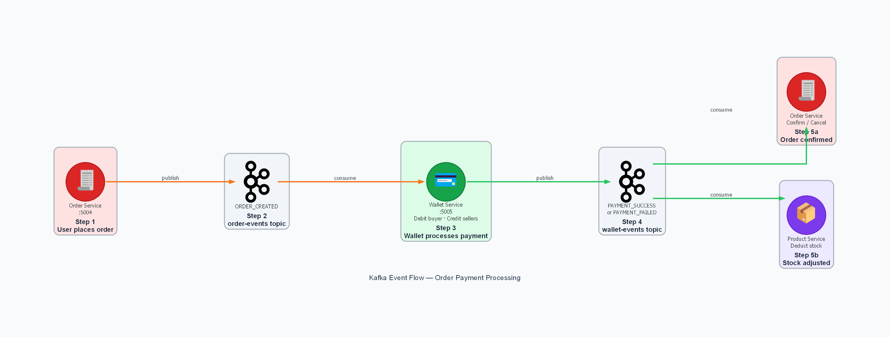

# MicroServices E-Commerce Platform

A full-stack e-commerce application built with a microservices architecture, demonstrating three deployment strategies across three git branches: local development, Docker Compose, and independent container deployment.

---

## System Architecture



**Arrow legend:** Orange = `ORDER_CREATED` event on `order-events` topic · Green = `PAYMENT_SUCCESS / FAILED` event on `wallet-events` topic

### Kafka Payment Event Flow




| Service | Port | Responsibility |
|---|---|---|
| Gateway | 4000 | Reverse proxy, CORS, single entry point |
| Auth | 5001 | Registration, login, JWT cookie issuance |
| Product | 5002 | Product catalog, image upload (Cloudinary), stock management |
| Cart | 5003 | Per-user shopping cart with live stock validation |
| Order | 5004 | Order placement, order history, Kafka producer |
| Wallet | 5005 | In-app wallet, payments via Kafka, transaction history |
| Frontend | 3000 | React 19 SPA (TailwindCSS) |

| Topic | Producer | Consumers |
|---|---|---|
| `order-events` | Order Service | Wallet Service |
| `wallet-events` | Wallet Service | Order Service, Product Service |

### Branch / Deployment Strategy

| Branch | Purpose | Kafka Broker | Service URLs | docker-compose |
|---|---|---|---|---|
| `master` | Local development | `localhost:9092` | hardcoded `localhost` | included (reference) |
| `docker` | Docker Compose | `kafka:9092` (container DNS) | hardcoded container DNS | full stack |
| `micro-service` | Independent containers / K8s | `KAFKA_BROKER` env var | all env-driven | not included |

---

## Tech Stack

| Layer | Technology |
|---|---|
| Runtime | Node.js 18, Express 5 |
| Database | MongoDB Atlas / MongoDB 6 (one database per service) |
| Messaging | Apache Kafka (KafkaJS) |
| Auth | JWT httpOnly cookies, bcryptjs |
| File uploads | Cloudinary + Multer |
| Frontend | React 19, React Router v7, Axios, TailwindCSS |
| Container | Docker, Docker Compose |

---

## Branch 1 — `master`: Local Development

Run every service directly on your machine. Requires local Kafka and MongoDB (or Atlas).

### Prerequisites

- Node.js 18+
- MongoDB running locally or a MongoDB Atlas URI
- Apache Kafka + Zookeeper running on `localhost:9092`

### Start Kafka (Docker — quickest way)

```bash
# Zookeeper
docker run -d --name zookeeper \
  -e ZOOKEEPER_CLIENT_PORT=2181 \
  -p 2181:2181 \
  confluentinc/cp-zookeeper:7.5.0

# Kafka
docker run -d --name kafka \
  -e KAFKA_BROKER_ID=1 \
  -e KAFKA_ZOOKEEPER_CONNECT=zookeeper:2181 \
  -e KAFKA_ADVERTISED_LISTENERS=PLAINTEXT://localhost:9092 \
  -e KAFKA_OFFSETS_TOPIC_REPLICATION_FACTOR=1 \
  -p 9092:9092 \
  --link zookeeper \
  confluentinc/cp-kafka:7.5.0
```

### Environment Variables

All service URLs are hardcoded to `localhost` in the `master` branch — only secrets need `.env` files.

**Auth Service** (`Backend/Auth-Service/.env`)
```env
PORT=5001
MONGO_URL=mongodb://localhost:27017/auth
JWT_SECRET=your_jwt_secret
CLIENT_URL=http://localhost:3000
```

**Product Service** (`Backend/Product-Service/.env`)
```env
PORT=5002
MONGO_URL=mongodb://localhost:27017/products
JWT_SECRET=your_jwt_secret
CLOUDINARY_CLOUD_NAME=your_cloud_name
CLOUDINARY_API_KEY=your_api_key
CLOUDINARY_API_SECRET=your_api_secret
```

**Cart Service** (`Backend/Cart-Service/.env`)
```env
PORT=5003
MONGO_URL=mongodb://localhost:27017/cart
JWT_SECRET=your_jwt_secret
```

**Order Service** (`Backend/Order-Service/.env`)
```env
PORT=5004
MONGO_URL=mongodb://localhost:27017/orders
JWT_SECRET=your_jwt_secret
CLIENT_URL=http://localhost:3000
```

**Wallet Service** (`Backend/Wallet-Service/.env`)
```env
PORT=5005
MONGO_URL=mongodb://localhost:27017/wallet
JWT_SECRET=your_jwt_secret
CLIENT_URL=http://localhost:3000
```

**Frontend** (`frontend/.env`)
```env
REACT_APP_GATEWAY_URL=http://localhost:4000
```

### Start All Services

Open a terminal for each service (or use a process manager like `pm2`):

```bash
cd Backend/Gateway       && npm install && npm start
cd Backend/Auth-Service  && npm install && npm start
cd Backend/Product-Service && npm install && npm start
cd Backend/Cart-Service  && npm install && npm start
cd Backend/Order-Service && npm install && npm start
cd Backend/Wallet-Service && npm install && npm start
cd frontend              && npm install && npm start
```

Frontend: http://localhost:3000 — Gateway: http://localhost:4000

---

## Branch 2 — `docker`: Docker Compose

One command brings up the full stack — services, Kafka, Zookeeper, and MongoDB — all containerized.

### Prerequisite

- Docker Desktop

### Run

```bash
git checkout docker
docker compose up --build
```

| Container | Port | Notes |
|---|---|---|
| `mongo` | 27017 | Persistent `mongo_data` volume |
| `zookeeper` | internal | Confluent CP Zookeeper |
| `kafka` | 9092 | Broker address `kafka:9092` inside Docker network |
| `gateway` | 4000 | Depends on all services |
| `auth-service` | 5001 | |
| `product-service` | 5002 | |
| `cart-service` | 5003 | |
| `order-service` | 5004 | |
| `wallet-service` | 5005 | |
| `frontend` | 3000 | Nginx serving React build |

### Stop

```bash
docker compose down        # keeps MongoDB data
docker compose down -v     # also deletes MongoDB volume
```

---

## Branch 3 — `micro-service`: Independent Container Deployment

Every service is fully environment-driven — no hardcoded URLs or broker addresses. Deploy each container independently to Kubernetes, AWS ECS, Render, Railway, or any platform by injecting env vars. The frontend `.env` references a Kubernetes service DNS name (`gateway-service.micro-services.local:4000`).

### What changed from the `docker` branch

| Config | `docker` branch | `micro-service` branch |
|---|---|---|
| Gateway service URLs | hardcoded container DNS | `AUTH_SERVICE_URL`, `PRODUCT_SERVICE_URL`, … env vars |
| Kafka broker | hardcoded `kafka:9092` | `KAFKA_BROKER` env var |
| CORS origin | `CLIENT_URL` env var | `FE_SERVICE_URL` / `GATEWAY_URL` env vars |
| Auth wallet call | hardcoded localhost | `GATEWAY_URL` env var |
| Cart product fetch | hardcoded localhost | `GATEWAY_URL` env var |
| docker-compose.yml | present | removed |

### Environment Variables

**Gateway** (`Backend/Gateway/.env`)
```env
FE_SERVICE_URL=http://your-frontend-url
AUTH_SERVICE_URL=http://your-auth-service:5001
PRODUCT_SERVICE_URL=http://your-product-service:5002
CART_SERVICE_URL=http://your-cart-service:5003
ORDER_SERVICE_URL=http://your-order-service:5004
WALLET_SERVICE_URL=http://your-wallet-service:5005
AUTH_COOKIE_DOMAIN=your-auth-domain
PRODUCT_COOKIE_DOMAIN=your-product-domain
```

**Auth Service** (`Backend/Auth-Service/.env`)
```env
PORT=5001
MONGO_URL=your_mongo_connection_string
JWT_SECRET=your_jwt_secret
GATEWAY_URL=http://your-gateway:4000
```

**Product Service** (`Backend/Product-Service/.env`)
```env
PORT=5002
MONGO_URL=your_mongo_connection_string
JWT_SECRET=your_jwt_secret
KAFKA_BROKER=your-kafka-broker:9092
CLOUDINARY_CLOUD_NAME=your_cloud_name
CLOUDINARY_API_KEY=your_api_key
CLOUDINARY_API_SECRET=your_api_secret
```

**Cart Service** (`Backend/Cart-Service/.env`)
```env
PORT=5003
MONGO_URL=your_mongo_connection_string
JWT_SECRET=your_jwt_secret
GATEWAY_URL=http://your-gateway:4000
```

**Order Service** (`Backend/Order-Service/.env`)
```env
PORT=5004
MONGO_URL=your_mongo_connection_string
JWT_SECRET=your_jwt_secret
KAFKA_BROKER=your-kafka-broker:9092
```

**Wallet Service** (`Backend/Wallet-Service/.env`)
```env
PORT=5005
MONGO_URL=your_mongo_connection_string
JWT_SECRET=your_jwt_secret
KAFKA_BROKER=your-kafka-broker:9092
```

**Frontend** (`frontend/.env`)
```env
REACT_APP_GATEWAY_URL=http://your-gateway:4000
```

### Build and run individual images

```bash
docker build -t gateway           ./Backend/Gateway
docker build -t auth-service      ./Backend/Auth-Service
docker build -t product-service   ./Backend/Product-Service
docker build -t cart-service      ./Backend/Cart-Service
docker build -t order-service     ./Backend/Order-Service
docker build -t wallet-service    ./Backend/Wallet-Service
docker build -t frontend          ./frontend

# Example: run Auth with injected env
docker run -d -p 5001:5001 --env-file ./Backend/Auth-Service/.env auth-service
```

---

## API Reference

All requests route through the Gateway at `http://localhost:4000`.

### Auth — `/api/auth`

| Method | Endpoint | Body | Auth | Description |
|---|---|---|---|---|
| POST | `/api/auth/register` | `{ name, email, password }` | — | Register; issues JWT cookie; auto-creates wallet |
| POST | `/api/auth/login` | `{ email, password }` | — | Login; issues JWT cookie |
| GET | `/api/auth/profile` | — | cookie | Current user profile |
| POST | `/api/auth/logout` | — | cookie | Clear JWT cookie |

### Products — `/api/products`

| Method | Endpoint | Body | Auth | Description |
|---|---|---|---|---|
| POST | `/api/products/new` | multipart: title, description, price, stock, sellerId, images | — | Create product |
| GET | `/api/products/allProducts` | — | — | List all products |
| POST | `/api/products/bulk` | `{ ids: [...] }` | — | Fetch products by ID array |
| GET | `/api/products/my-products` | — | cookie | Seller's own listings |
| PATCH | `/api/products/:id/stock` | `{ stock }` | cookie | Update stock count |

### Cart — `/api/cart`

| Method | Endpoint | Body | Auth | Description |
|---|---|---|---|---|
| POST | `/api/cart` | `{ productId, quantity }` | cookie | Add item |
| GET | `/api/cart` | — | cookie | Get cart with live stock flags |
| PUT | `/api/cart/:id` | `{ type: "increase" \| "decrease" }` | cookie | Adjust quantity |
| DELETE | `/api/cart/clear` | — | cookie | Empty cart |
| DELETE | `/api/cart/:id` | — | cookie | Remove one item |

### Orders — `/api/orders`

| Method | Endpoint | Body | Auth | Description |
|---|---|---|---|---|
| POST | `/api/orders/place-order` | `{ products: [{productId, sellerId, quantity, price}], totalAmount }` | cookie | Place order; triggers Kafka payment flow |
| GET | `/api/orders/my-orders` | — | cookie | Order history |

### Wallet — `/api/wallet`

| Method | Endpoint | Body | Auth | Description |
|---|---|---|---|---|
| GET | `/api/wallet` | — | cookie | Balance + transaction history |
| POST | `/api/wallet/add-money` | `{ amount }` | cookie | Top up wallet |
| POST | `/api/wallet/create` | `{ userId }` | — | Create wallet (called internally by Auth on register) |

---

## Payment Flow — Step by Step

1. User calls `POST /api/orders/place-order`
2. Order Service creates `ParentOrder` + one `ChildOrder` per seller (status: `Pending`)
3. Order Service publishes `ORDER_CREATED` to the `order-events` Kafka topic
4. Wallet Service consumes `ORDER_CREATED`:
   - Checks buyer balance
   - Debits buyer; credits each seller proportionally
   - Publishes `PAYMENT_SUCCESS` or `PAYMENT_FAILED` to `wallet-events`
5. Order Service consumes `wallet-events`:
   - `PAYMENT_SUCCESS` → `paymentStatus = "completed"`, child orders → `"Confirmed"`
   - `PAYMENT_FAILED` → `paymentStatus = "failed"`, child orders → `"Cancelled"`
6. Product Service consumes `wallet-events`:
   - `PAYMENT_SUCCESS` → decrements stock for each purchased item

---

## Data Models

```
User          { name, email, password(hashed) }
Product       { title, description, price, images[], stock, sellerId }
CartItem      { productId, consumerId, sellerId, quantity }
ParentOrder   { consumerId, childOrders[], totalAmount, paymentStatus }
ChildOrder    { parentOrderId, consumerId, sellerId, products[], subtotal, status }
Wallet        { userId, balance(default:5000), transactions[]{type,amount,description,orderId} }
```

Order status lifecycle: `Pending → Confirmed → Shipped → Delivered` (or `Cancelled` on payment failure)

---

## Project Structure

```
MicroServices/
├── Backend/
│   ├── Gateway/              Express reverse proxy
│   ├── Auth-Service/         JWT auth, user registration/login
│   ├── Product-Service/      Catalog, Cloudinary uploads, Kafka consumer
│   ├── Cart-Service/         Shopping cart, inter-service HTTP
│   ├── Order-Service/        Order placement, Kafka producer + consumer
│   └── Wallet-Service/       In-app payments, Kafka producer + consumer
├── assets/
│   ├── system_architecture.png  Full service topology diagram
│   └── kafka_flow.png           Kafka payment event flow diagram
├── frontend/                 React 19 SPA
└── README.md
```
